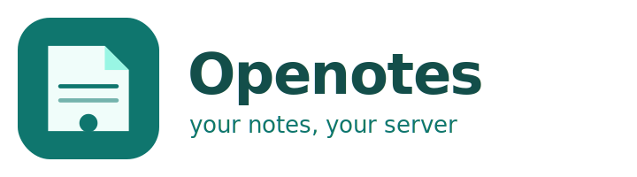

<div align="center">

<p align="center"></p>

**A desktop notes application that keeps your notes yours.**

Offline-first · end-to-end encrypted · syncs over your own WebDAV server ·
no account, no subscription, no cloud

A fork of [Notesnook](https://github.com/streetwriters/notesnook) · GPL-3.0-or-later

</div>

---

## What this is

Openotes takes Notesnook's editor, note engine and encryption — mature,
audited software — and changes what sits underneath:

- **No Notesnook account.** Nothing to sign up for. The application opens
  straight into a local vault.
- **Your server, or none at all.** Synchronization goes to a WebDAV server
  you control — Nextcloud, ownCloud, Apache, nginx, a Raspberry Pi. Or skip
  it entirely and stay on one machine.
- **Encrypted before it leaves.** Notes, attachments and backups are
  encrypted on your machine. The server stores ciphertext and never receives
  a key. Even the filenames are keyed digests, so a directory listing gives
  nothing away.
- **No subscription tiers.** Every local feature is available. There is no
  paywall to remove because there is no hosted business model behind it.
- **No Electron.** It runs on Deno Desktop using the webview your operating
  system already ships, so there is no second browser engine to download,
  install or keep updated.
- **No telemetry.** None. There is no endpoint to configure.

## What it is not

Being clear about this matters more than a feature list:

- **Not an official Notesnook build.** Different name, different identifier,
  different data directory. Please do not report its bugs to them.
- **Not a way to get Notesnook Pro for free.** The hosted subscription model
  is *removed*, not circumvented. This application never contacts
  Notesnook's servers and never claims a subscription it does not have.
- **Not mobile.** Desktop only — Windows and Linux.
- **Not a hosted web app.** There is nothing to deploy.
- **Not a way to recover a lost passphrase.** Encryption without a back door
  means exactly that. Losing your sync passphrase means losing access to the
  remote data.

---

## Installing

| Platform | Format |
|---|---|
| Windows | `.exe` |
| Windows | `.msi` |
| Windows | portable `.zip` |
| Linux Universal | `.AppImage` |
| Flatpak | `.flatpak` |
| Debian/Ubuntu | `.deb` |
| Fedora/RHEL | `.rpm` |
| Arch/Manjaro | `.pkg.tar.zst` |
| Generic Linux | `.tar.gz` |

Download from the
[releases page](https://github.com/yuvalkolodkingal/notesnook/releases) and
verify what you downloaded against the published `SHA256SUMS`:

```bash
sha256sum --check --ignore-missing SHA256SUMS
```

### Windows

Run the `.msi` for a normal installation, or the `.exe` if you would rather
not install anything. Windows 10 and 11 already include the WebView2 runtime
that Openotes uses.

### Linux

```bash
# AppImage — works anywhere
chmod +x Openotes-1.0.0-linux-x86_64.AppImage
./Openotes-1.0.0-linux-x86_64.AppImage

# Debian / Ubuntu
sudo apt install ./Openotes-1.0.0-linux-x86_64.deb

# Fedora / RHEL
sudo dnf install ./Openotes-1.0.0-linux-x86_64.rpm

# Arch / Manjaro
sudo pacman -U openotes-1.0.0-1-x86_64.pkg.tar.zst

# Flatpak
flatpak install Openotes-1.0.0-linux-x86_64.flatpak
```

Linux needs **WebKitGTK** (`libwebkit2gtk-4.1-0` on Debian and Ubuntu,
`webkit2gtk-4.1` on Arch). The distribution packages pull it in; the
AppImage expects it to be present.

---

## First run

```
Welcome
   ↓
Create a local vault, set an encryption password
   ↓
Connect a WebDAV server            ← optional, skip for local-only
   ↓
Import an existing backup          ← optional
   ↓
Start writing
```

Everything after the first step is optional. Openotes is fully usable
without a server and without a network connection.

### Connecting WebDAV

`Settings → Synchronization → WebDAV`

| Field | Example |
|---|---|
| Server URL | `https://cloud.example.com/remote.php/dav/files/yourname/` |
| Username | your WebDAV username |
| Password | your WebDAV password, or an app password |
| Remote directory | `Openotes` |
| Sync passphrase | **what encrypts your notes** — not your WebDAV password |

Press **Test connection** first; it checks reachability, credentials and the
passphrase without writing anything.

> **The sync passphrase is the important one.** It never reaches the server,
> and there is no recovery path. Use the same passphrase on every device you
> want to sync, and store it somewhere safe.

Then, on your second machine: the same server, directory and passphrase.
That is the whole setup.

### Backups

`Settings → Backup`

Backups are a **separate** system from sync — snapshots for disaster
recovery rather than device convergence. Deleting a note and syncing that
deletion never touches a backup that contains it.

You can back up to a local folder, to your WebDAV server, or both, on a
manual, daily, weekly or monthly schedule with a retention count. Restoring
takes a verified safety backup of your current data first, so a restore you
regret is itself recoverable.

### Coming from Notesnook

Export a backup from Notesnook and import it here. Openotes never touches
your existing Notesnook installation or its data.

---

## Sync status

The status indicator tells you exactly where things stand:

| | |
|---|---|
| ✓ Synced | Everything is on the server. |
| ↻ Syncing | A cycle is running. |
| ○ Offline | No connection. Your changes are queued and will go out later. |
| ⋯ Pending changes | Changes are waiting, and will be sent. |
| ! Sync error | Something needs your attention; the message says what. |
| ⚠ Conflict | Two devices edited the same note. **Both versions were kept.** |

A sync problem never blocks editing. Local changes go into a queue that
survives restarts and drains when the server comes back.

---

## Building from source

Requires [Deno](https://deno.land) 2.9+ and a C compiler.

```bash
git clone https://github.com/yuvalkolodkingal/notesnook.git openotes
cd openotes
deno task build:native   # encrypted SQLite + search extensions
deno task build:ui
deno task dev
```

Full instructions, including packaging, are in [BUILDING.md](BUILDING.md).

---

## Documentation

| | |
|---|---|
| [BUILDING.md](BUILDING.md) | Development and builds, entirely in Deno |
| [ARCHITECTURE.md](ARCHITECTURE.md) | How it is put together, and why |
| [WEBDAV.md](WEBDAV.md) | The sync protocol, in reimplementable detail |
| [SECURITY.md](SECURITY.md) | Threat model — including what is *not* protected |
| [PACKAGING.md](PACKAGING.md) | Every release artifact and how it is produced |
| [UPSTREAM.md](UPSTREAM.md) | Relationship to Notesnook, and merging from it |
| [CONTRIBUTING.md](CONTRIBUTING.md) | How to help |
| [PORTING_NOTES.md](PORTING_NOTES.md) | The audit behind the port |

---

## Credit

Openotes exists because of the work of
[Streetwriters](https://github.com/streetwriters) on
[Notesnook](https://github.com/streetwriters/notesnook): the editor, the
data model, the encryption and most of the interface are theirs. This fork
changes the host runtime and the synchronization backend, and removes the
hosted service; it did not write a notes application from scratch and does
not claim to have.

If you want a maintained, supported, cross-platform notes app with mobile
clients and a team behind it, **use Notesnook** — and consider paying for it.
This fork exists for people who specifically want to keep their notes on
infrastructure they control.

## Licence

GPL-3.0-or-later, as upstream. See [LICENSE](LICENSE). Upstream copyright
notices and attribution are preserved throughout.
